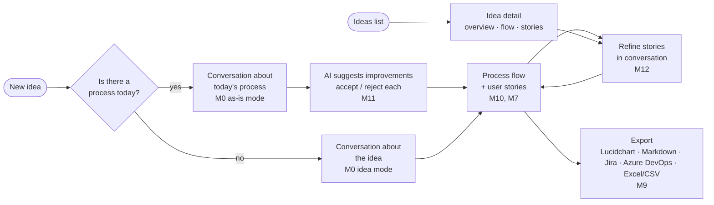

# 00 — Overview

## 0. What the product is

**Requirements Studio is a conversational requirements and discovery tool.** Someone describes an idea, or a process
they want to improve. The Studio holds a conversation to understand it (including how it works today, if it exists),
suggests where AI agents can help, and produces a **process flow** and **detailed user stories** that can be refined
and exported.

### User journeys

| # | Journey | Spec |
|---|---|---|
| J1 | **New idea → conversation** about the idea, or about the as-is process if one exists **→ flow + user stories** | M0, M10, M7 |
| J2 | **Ideas list → idea detail** with flow presented **→ list of user stories** with details | M12 |
| J3 | **Refine user stories** further, in conversation or inline | M12 |
| J4 | **Ask about the as-is process and improve it** where AI agents can help (suggestions accepted one by one) | M11 |
| J5 | **Export outputs**: Lucidchart (.drawio) + Mermaid, Markdown + Gherkin, Jira CSV, Azure DevOps CSV, Excel/CSV | M9 |

### Outputs per idea

| Output | Format | For |
|---|---|---|
| **Process flow**: to-be, plus as-is when one exists. Swimlanes marking automated steps, human reviews, approval gates and human queues; to-be steps show which suggestion changed them | `.drawio` (imports into Lucidchart as editable shapes) + Mermaid | Process owners, risk, architects |
| **Detailed user stories**: value-based *so that*, Given/When/Then incl. edge cases, rules, data, NFRs, dependencies, human control, change from today, open questions | Markdown + Gherkin; Jira / Azure DevOps CSV; Excel/CSV | Business, BA, QA, delivery |
| **Improvements report**: what the AI suggested, what was accepted, hours saved | Markdown + Excel sheet | Sponsors, process owners |

Supporting capabilities (kept, but not the core journey): document upload and extraction (M1/M2), SME question routing
(M6), the gap inbox (M5), and the MOTHER package (M9) for building agents.

## 1. Problem

Requirements gathering for multi-agent automation routinely takes months. Root causes:

| Cause | Effect | Studio response |
|---|---|---|
| Ideas arrive as one-liners, and nobody knows what to ask next | Weeks of meetings just to frame the work | **Discovery interview** walks a coverage checklist, one question at a time |
| People are asked to *write* requirements from a blank page | Slow, inconsistent, incomplete | Draft from existing material; people **correct** |
| The right SME isn't in the workshop | Questions wait weeks for the next session | Async, targeted questions **routed to the right person** |
| Gaps surface only at build time | Rework, scope churn | **Gap detector** runs continuously on the IR |
| Stories are prose; nobody can tell if they're "done" | Endless refinement | **Per-story confidence** + deterministic **Definition of Ready** |
| Downstream automation (MOTHER) has to re-parse prose | Lossy, ambiguous | Structured **Process IR** is the deliverable; stories are a view |

## 2. Goals

- **G0. Start from just an idea.** A requester with no documents types or speaks an idea and is interviewed, one
  targeted follow-up question at a time, until the idea is a complete process with detailed, ready user stories
  (M0). Documents are optional extra input.
- G1. Produce a first-draft process diagram from uploaded material within minutes of ingestion.
- G2. Every element shows where it came from (provenance) and how sure we are (confidence).
- G3. Questions are asked only where there is a detected gap; each is routed to the most suitable SME.
- G4. Answers become reviewed IR patches, not chat history.
- G5. Stories with Given/When/Then acceptance criteria are rendered from the IR and pass a deterministic DoR.
- G6. Export a versioned, hashed package MOTHER can import without re-interpretation.
- G7. Every step's human control is explicit (automated / human review / human task / approval gate) and drawn on a
  Lucidchart-importable process flow (M10).

**Target metrics:** idea to DoR-passing stories in ≤ 2 working days and ≤ 1 hour of requester time for a
~10-step process (the client KYC sample: as-is interview, 7 AI suggestions, 9 stories in about a day). Document-led: median elapsed time from first upload to DoR-passing package ≤ 10 working days for a
process of ~20 tasks (baseline: 8–12 weeks).

## 3. Non-goals (v1)

- Building or running agents (that's MOTHER and the multi-agent platform).
- Full BPMN 2.0 fidelity. We use a BPMN-lite node set (see IR spec).
- Screen-recording ingestion (phase P10, designed for but not built in v1).
- Editing stories as free text.

## 4. Users and roles

| Role | Does | Key screens |
|---|---|---|
| **Requester** | Has the idea; answers the discovery interview; owns the process they start | Intake workspace |
| **Process Owner** | Accountable for the process; approves patches, signs off DoR | Canvas, Gap inbox, DoR dashboard |
| **Business Analyst (BA)** | Uploads sources, curates the IR, reviews proposed patches | All |
| **SME** | Answers routed questions; may confirm elements | SME portal (lightweight), Teams/email |
| **Reviewer / QA** | Reviews stories and acceptance criteria | Stories view |
| **MOTHER (system)** | Consumes export packages | API only |
| **Admin** | Manages SME directory, thresholds, integrations | Settings |

## 5. Design principles

1. **Correct, don't author.** The default interaction is accept / edit / reject on a proposal.
2. **Ask less, ask better.** No question without a gap. Batch per SME. Offer suggested answers.
3. **Machine view first.** IR is the truth; human views are rendered.
4. **Show your evidence.** Provenance on every element; click-through to the source excerpt.
5. **Deterministic gates.** DoR and confidence are explainable formulas, not LLM opinions.
6. **Audit everything.** Who changed what, why, based on which answer or source.

## 6. Glossary

| Term | Meaning |
|---|---|
| **Process IR** | The structured intermediate representation of a business process (`schemas/process-ir.schema.json`). |
| **Element** | Any IR object with an id: actor, entity, node, edge, rule, exception, SLA, acceptance criterion, story. |
| **Source** | An ingested artefact (SOP, transcript, email, doc…). |
| **Provenance** | Link from an element to a source locator + excerpt, with stance `supports` or `contradicts`. |
| **Patch** | A JSON Patch (RFC 6902) envelope proposing a change to the IR. |
| **Gap** | A detected defect or uncertainty in the IR that blocks or weakens readiness. |
| **Question** | A gap (or batch of gaps) phrased for, and routed to, an SME. |
| **DoR** | Definition of Ready: deterministic checks a story must pass before export. |
| **Package** | Versioned export bundle for MOTHER. |
