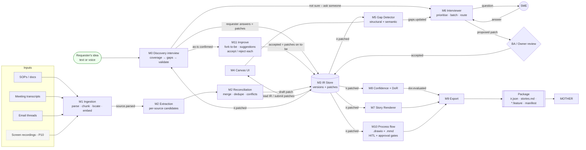
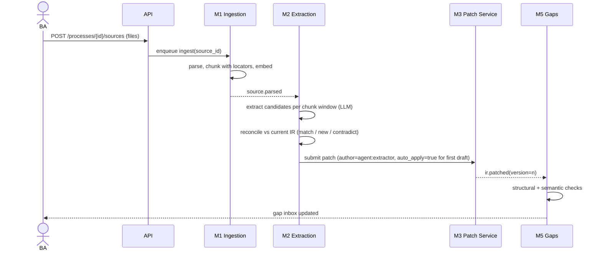
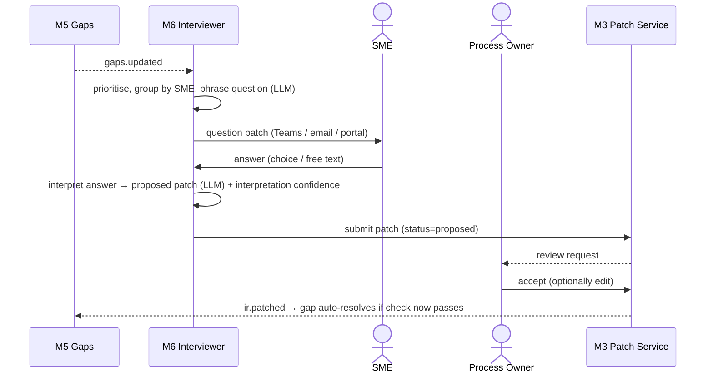
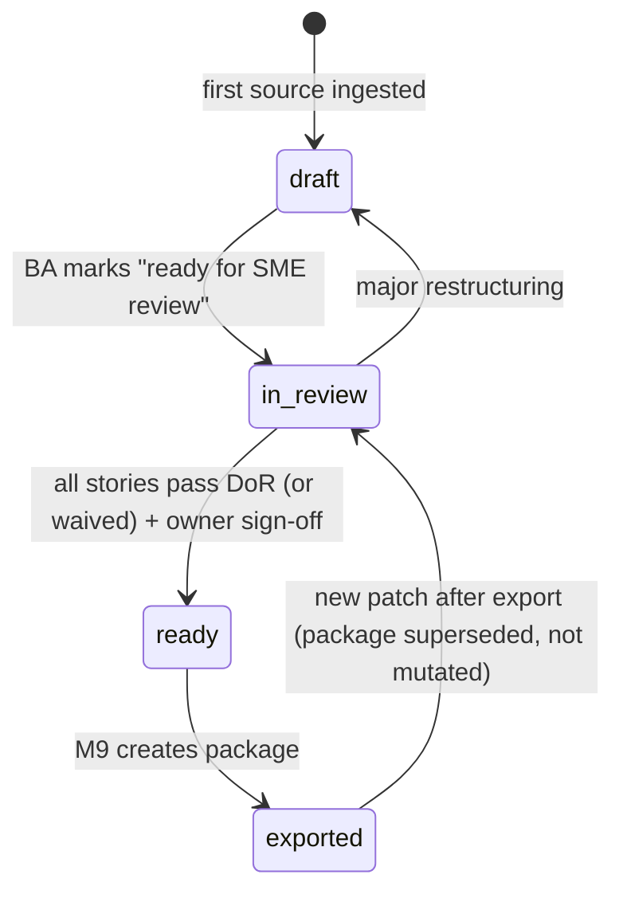

# 01 — Architecture

## 1. Module map

| ID | Module | Kind | Owns |
|---|---|---|---|
| **M0** | **Idea Intake & Discovery Interview** | API + worker + UI | `intake_sessions`, `intake_turns` — primary entry point |
| M1 | Source Ingestion | Worker + API | `sources`, `source_chunks`, object storage |
| M2 | Extraction & Reconciliation | Worker (LLM) | `extraction_runs`; emits draft patches |
| M3 | IR Store & Patch Service | Core service | `ir_versions`, `ir_patches` — **only writer of IR** |
| M4 | Process Canvas UI | Frontend | — (reads IR, submits patches) |
| M5 | Gap Detector | Worker (rules + LLM) | `gaps` |
| M6 | Interviewer & SME Routing | Worker + API + UI | `smes`, `questions`, `answers` |
| M7 | Story & Gherkin Renderer | Library + worker | `stories` (cache) |
| M8 | Confidence & Definition of Ready | Library | `dor_reports` |
| M10 | Process Flow Diagram | Library | — (renders `.drawio` for Lucidchart + Mermaid from the IR, as-is and to-be) |
| **M11** | **As-Is Analysis & AI Improvement** | API + worker (rules + LLM) | `suggestions`; forks the to-be |
| **M12** | **Ideas Workspace & Story Refinement** | API + UI | `ideas`, `story_refinements` |
| M9 | Exports | API + worker | `exports`, files: Lucidchart, Markdown, Gherkin, Jira, Azure DevOps, Excel/CSV, MOTHER package |

Shared services:

| ID | Service | Notes |
|---|---|---|
| S1 | LLM Gateway | Loads prompts by file name from `prompts/`, model routing, JSON-mode validation, logging to `llm_calls` |
| S2 | Notifications | Adapter interface: in-app, email, Microsoft Teams |
| S3 | Identity & Audit | SSO (Entra ID / OIDC), RBAC, `audit_log` |
| S4 | Event Bus | Redis Streams; at-least-once; consumers idempotent on `event_id` |

## 2. End-to-end data flow

Two entry paths feed the same IR. **Idea-first** (M0) is the default: a requester types or speaks an idea and is
interviewed. **Document-first** (M1/M2) drafts from existing material. Both can be mixed in one session, e.g. by
uploading an SOP mid-interview.



**The loop that replaces months:** for an idea, `answer → patch → coverage/gaps → next question` runs in the
conversation in seconds, and only "ask someone" questions leave it. For documents, `ir.patched → gap detection → targeted question → answer → patch → ir.patched`.
Each turn of the loop is hours, not a workshop cycle.

## 3. Key sequences

### 3.0 Idea to ready stories (M0)
See `docs/modules/M0-idea-intake-discovery.md §3` for the turn loop. Phases: Discover (coverage checklist) →
Deepen (gaps, drafted ACs) → Validate (priorities, playback, confirm) → sign-off. Worked example:
`samples/client_kyc/intake_session_kyc.json`: as-is interview (17 turns), fork, 7 suggestions (6 accepted), a story refinement, 9 ready stories, as-is and to-be flows, exports.

### 3.1 Upload to first draft



### 3.2 Gap to answer to patch



### 3.3 Correction on canvas

User drags an edge, renames a node, or clicks "Confirm" on an element → canvas builds JSON Patch ops →
`POST /patches` with `author=user`, `auto_apply=true` (user edits apply immediately; they are the review) →
new version → re-render.

## 4. Process status lifecycle



## 5. Concurrency and versioning

- IR versions are immutable snapshots (`ir_versions.version` monotonically increasing per process) plus the
  patch that produced them (event-sourced; snapshot every version for simplicity — IRs are small, < 1 MB).
- Patches carry `base_version`. If `base_version < current`, the Patch Service attempts **path-level rebase**:
  if no op path in the patch was touched by intervening patches, apply; otherwise reject with `409 conflict`
  and return the conflicting paths.
- Derived artefacts (gaps, stories, DoR) record the `ir_version` they were computed from and are recomputed on
  `ir.patched`. Consumers ignore events for versions older than what they have.

## 6. Technology stack

| Layer | Choice | Reason |
|---|---|---|
| API | FastAPI, Pydantic v2 | Matches existing Python agent platform |
| Workers | arq on Redis | Simple async jobs; retries; cron for reminders |
| DB | Postgres 16 + pgvector | JSONB for IR snapshots; vector search over chunks and SMEs |
| Object store | Azure Blob (S3-compatible adapter for local MinIO) | Source originals, packages |
| Parsing | `unstructured` / `pypdf` / `python-docx` / `mail-parser` / `webvtt-py` / `openpyxl` | Per-format parsers behind one interface |
| LLM | via S1 gateway; model configurable per prompt key | No vendor lock in modules |
| Frontend | React + TS + Vite, React Flow, TanStack Query, Tailwind, `elkjs` for auto-layout | Canvas editing |
| Auth | OIDC (Entra ID) | Enterprise SSO |
| Notifications | Graph API (Teams, Outlook) behind S2 adapter | Reach SMEs where they work |

## 7. Repository layout

```
requirements-studio/
  apps/
    api/                  FastAPI app: routers per module, DI wiring
    worker/               arq worker entrypoints per module
    web/                  React frontend
  packages/
    ir_core/              Pydantic IR models, JSON Patch apply, validators, id rules
    confidence_dor/       M8 pure functions
    story_renderer/       M7 templates + renderer
    flow_renderer/        M10 draw.io + Mermaid renderer (port of tools/render_flow.py)
    exporters/            M9 Jira / ADO / CSV / xlsx / Markdown (port of tools/render_exports.py)
    gap_rules/            M5 structural checks (pure)
  services/
    intake/               M0 (session state machine, coverage, next_target, turn loop)
    improve/              M11 (heuristics, guardrails, suggestion lifecycle, fork)
    ideas/                M12 (ideas list/detail, story refinement)
    ingestion/            M1
    extraction/           M2
    ir_store/             M3
    gaps/                 M5 orchestration (calls gap_rules + LLM)
    interviewer/          M6
    export/               M9
    llm_gateway/          S1
    notifications/        S2
    identity_audit/       S3
  migrations/             Alembic
  prompts/                one .md file per prompt (front matter + Jinja2 body), loaded by file name
  samples/                fixtures (copied from this pack)
  schemas/                JSON Schemas (copied from this pack)
  tools/
  tests/
```

## 8. Events

All events: `{event_id, type, process_id, ir_version?, occurred_at, correlation_id, payload}`.

| Type | Producer | Payload | Consumers |
|---|---|---|---|
| `intake.turn_completed` | M0 | `session_id, n, patch_id, coverage` | UI |
| `intake.phase_changed` | M0 | `session_id, from, to` | UI, M7 |
| `source.uploaded` | API | `source_id` | M1 |
| `source.parsed` | M1 | `source_id, chunk_count` | M2 |
| `extraction.completed` | M2 | `run_id, patch_id, stats` | UI |
| `ir.patched` | M3 | `patch_id, from_version, to_version, changed_paths[]` | M5, M7, M8, UI |
| `patch.proposed` | M3 | `patch_id, author, reviewer_ids[]` | S2, UI |
| `gaps.updated` | M5 | `opened[], resolved[], ir_version` | M6, UI |
| `question.sent` / `question.answered` / `question.escalated` | M6 | `question_id, sme_id` | UI, S3 |
| `dor.evaluated` | M8 | `report_id, ready_count, total` | UI, M9 |
| `export.created` | M9 | `export_id, package_uri, ir_hash` | MOTHER webhook, UI |
