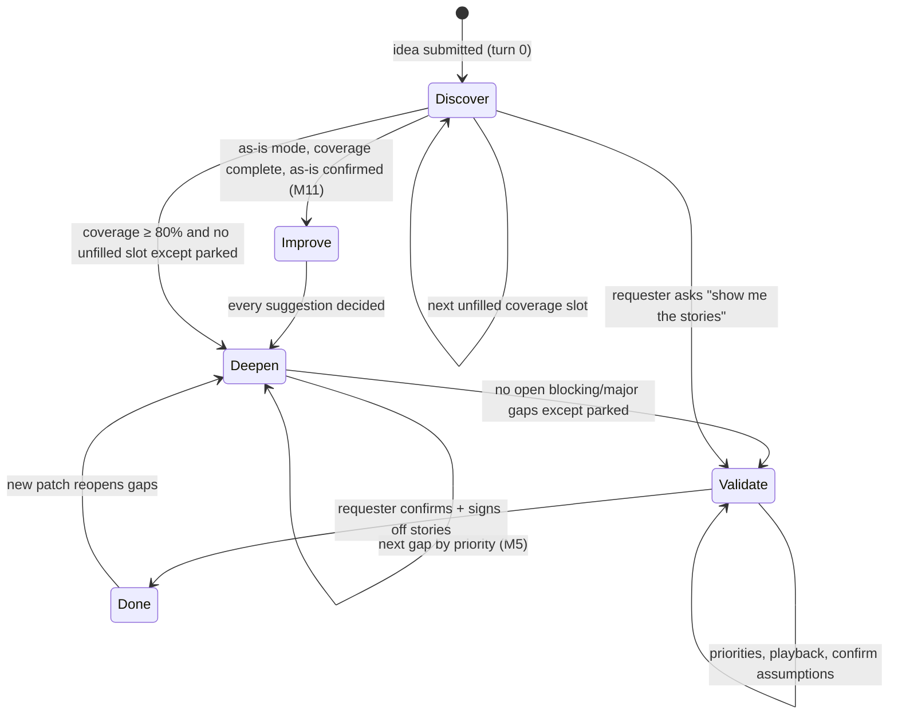
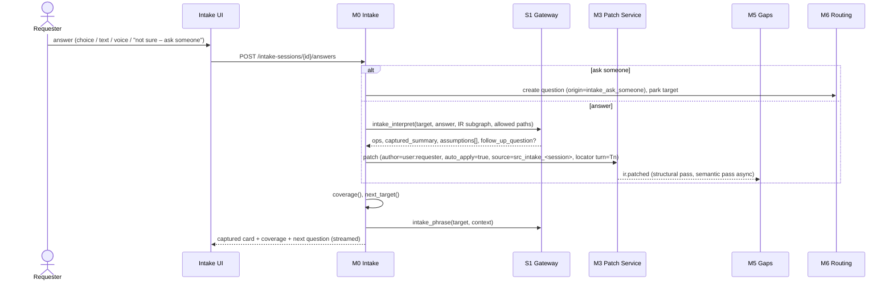

# M0 — Idea Intake & Discovery Interview

## Purpose
Let a person start with **nothing but an idea** ("I want to automate our client KYC checks"),
then run a guided conversation that asks one well-chosen follow-up question at a time until the idea is a
complete process model with **detailed, ready user stories**. Documents are optional extra input, not a
precondition.

This is the primary entry point. The document-led path (M1/M2) feeds the same IR, and M0 adapts its
questions to whatever the documents have already answered.

## Who it serves
- **Requester** (idea owner, e.g. an Audit Manager). Answers most questions. Default answerer.
- **SMEs**. Pulled in only for questions the requester marks *"Not sure — ask someone"* (routed via M6).
- **BA**. Optional. Can sit in the session, take over, or edit the canvas.

## Design rules
1. **One question per turn.** Merge only closely related gaps of the same type (e.g. priorities for all stories).
2. **Every question explains itself.** A short *"Why I'm asking"* line tied to a coverage slot or gap.
3. **Every question offers suggested answers**, plus three standard options: *Other (type)*, *Not sure — ask
   someone*, and *Skip for now*.
4. **Show what was captured.** After each answer, a *Captured* card lists the changes in plain English
   (from the patch), with **Undo** and **Edit**. The canvas and draft stories update live.
5. **Assumptions are surfaced, never hidden.** Anything the model inferred (not stated) is tagged
   `src_inferred`, shown as *"I assumed…"* and confirmed in the Validate phase.
6. **Never re-ask what is already known** from documents, earlier answers or SME answers.
7. **The requester can stop at any time.** "Show me the stories now" jumps to Validate with whatever exists.
   DoR shows what's still missing.

## Modes: idea or as-is

The first question, asked on the New idea screen, is **"Is there a process today?"**

| Answer | Mode | What the interview captures | Then |
|---|---|---|---|
| No | `idea` | The desired process, directly as the **to-be** | Deepen → Validate |
| Yes | `as_is` | **How the work is done today** (questions phrased "today…"), including slot C17 effort & pain points | Confirm as-is → **M11 Improve** (AI suggestions, accept/reject each) → Deepen → Validate on the to-be |
| Not sure | `idea`, switchable | Starts in idea mode. If answers describe current practice, M0 offers to switch to as-is | — |

In as-is mode the IR is created with `process.variant = "as_is"`. After confirmation, M11 forks the to-be. Deepen,
Validate, stories and DoR then work on the **to-be**. The as-is stays frozen for the as-is flow and comparisons.

## Phases



| Phase | Driven by | Typical questions | Exit |
|---|---|---|---|
| **Improve** (as-is mode only) | M11 suggestions | accept / reject / edit each AI improvement | every suggestion decided |
| **Discover** | Coverage checklist (§1) | goal, trigger, outcome, success metric, steps, who, decisions, timing, exceptions, data, systems, volume, NFRs, scope, beneficiaries, **human checkpoints and approval gates** | coverage ≥ 0.80 and every slot filled or parked |
| **Deepen** | M5 gaps (structural + semantic), AC drafting | "If KYC overruns 3 days, who's told?", "What match score needs review?" | no open blocking or major gaps except parked ones |
| **Validate** | Story-level DoR checks | priorities (MoSCoW), "Here's the process as I understand it: confirm or correct", assumptions | all stories pass DoR except sign-off |
| **Done** | Sign-off (M8) | — | stories signed off → process `ready` |

## 1. Coverage checklist (deterministic; reference: `tools/rs_reference.py::coverage`)

Slots are evaluated against the IR after every patch. Default **discovery order** (configurable per tenant):

| Order | Slot | Key | Weight | Filled when | Depends on |
|---|---|---|---|---|---|
| 1 | C01 | goal | 0.08 | ≥ 1 goal | — |
| 2 | C04 | trigger | 0.07 | a `start` node with a description | — |
| 3 | C05 | outcome | 0.07 | ≥ 1 `end` node | — |
| 4 | C02 | success_metric | 0.07 | ≥ 1 goal metric with a target | — |
| 5 | C06 | happy_path | 0.10 | ≥ 3 tasks, and every live task/decision/wait is reachable from start and can reach an end (edges + exception/SLA routes) | C04, C05 |
| 6 | C07 | actors | 0.07 | every task has `actor_id` | C06 |
| 7 | C08 | decisions | 0.07 | ≥ 1 decision whose rule is `table`/`expression`, or `decisions` ∈ `scope.confirmed_none` | C06 |
| 8 | C13 | timing | 0.06 | ≥ 1 SLA | C06 |
| 9 | C09 | exceptions | 0.07 | ≥ 1 exception, or `exceptions` ∈ `confirmed_none` | C06 |
| 10 | C10 | data | 0.06 | ≥ 1 entity used by a node, and every entity in node inputs/outputs has ≥ 2 attributes | — |
| 11 | C11 | systems | 0.04 | ≥ 1 `system` actor, or `systems` ∈ `confirmed_none` | — |
| 12 | C12 | volume | 0.05 | an NFR with category `volume` | — |
| 13 | C14 | nfrs | 0.05 | NFRs with categories `security` **and** `audit` | — |
| 14 | C15 | scope | 0.04 | `scope.in` and `scope.out` each non-empty | — |
| 15 | C03 | personas | 0.04 | ≥ 1 persona | — |
| 16 | C16 | human_controls | 0.06 | every task has `hitl.mode` (automated / hitl_review / human_task / approval) | C06, C07 |
| 17 | C17 | pain_points (**as-is only**) | 0.06 | at least one task has `as_is_effort.minutes_per_case` | C06 |

In as-is mode coverage is normalised over the 17 applicable slots. In idea mode C17 doesn't apply and the 16 weights sum to 1.

C16 comes last on purpose. Once the whole flow is known, the requester can see every step and say which run
automatically, which a person reviews, and where someone must approve. Approvals described as a separate check
become their own task with `approved`/`rejected` edges.

`coverage = Σ weight(filled slots)`. Parked slots count as 0 but don't block the phase change.
A slot can go back from filled to unfilled when new information arrives (e.g. a new entity with one attribute).
That's expected and shown in the coverage meter.

## 2. Next-question selection (deterministic)

```
next_target(state):
  1. if last interpretation returned follow_up_question → target = follow_up
  2. phase Discover:
       first slot in discovery order that is unfilled, not parked, dependencies filled → target = slot
       (gaps never interrupt Discover; a blocking gap usually maps to an upcoming slot,
        e.g. wait_without_timeout ↔ C13)
  3. phase Deepen:
       open gaps (status open), excluding parked, ordered by M5 priority → target = gap
       (gaps of the same type and severity may be merged into one question)
  4. phase Validate:
       story_priority_missing (merged) → story_value_missing → playback_confirm → signoff
```
Selection is pure Python. The LLM only **phrases** the question (`prompts/intake_phrase.md`).

## 3. The turn loop



Interpretation rules (in addition to M6 §5 validation):
- Patches from requester answers are `auto_apply=true` (the requester is a user stating facts about their own
  idea). Elements are `proposed` with provenance `src_intake_<session>` at locator `turn: Tn`, excerpt = the part
  of the answer they came from (**must be a verbatim substring**; the validator enforces this). Confidence
  starts at 0.8 × 0.9 = **0.72 (amber)**, and turns green when confirmed in Validate.
- Inferred elements (implied steps, drafted ACs, goal links) use `src_inferred` (weight 0.3) and are listed as
  `assumptions` on the turn.
- The interpreter may **refine** earlier elements, e.g. upgrade a natural-language rule to an expression once
  the data it depends on is known. Refinements are ordinary ops in the same patch.
- Undo = inverse patch of that turn (M3). Edit = opens the element on the canvas; the edit is a user patch.

### Special answers
| Answer | Behaviour |
|---|---|
| *Not sure — ask someone* | Requester may name a person, otherwise M6 scores SMEs. A question is sent (status `sent`, origin `intake_ask_someone`). The target is **parked** and the session moves on. When the SME answers, the answer is interpreted into a patch (M6 §5), status `proposed`, and the requester sees it as a *Captured from James* card to accept. |
| *Skip for now* | Target parked for this session. Re-offered in Validate if it blocks DoR. |
| Partial answer | Interpreter fills what it can and returns `follow_up_question`. |
| Contradiction with earlier answer/document | Interpreter adds `contradicts` provenance. The next question is a neutral conflict question. |
| Documents uploaded mid-session | M1/M2 run. The resulting patch is shown as a captured card. Coverage recalculates, so already-answered slots are skipped. |

### Playback
Every 5 turns, and at each phase change, M0 posts a **playback**: a short plain-English summary of the process
as currently understood (`prompts/intake_playback.md`), plus the live canvas snapshot. The requester replies
*"Yes"* or corrects it, and corrections are interpreted like any answer. In Validate, the final playback's
"Yes" confirms every `proposed` element: one patch setting `meta.status=confirmed`,
`confirmed_by=<requester user id>`.

### Acceptance-criteria drafting
On entering Deepen, M0 calls `prompts/intake_draft_acs.md` for every task/decision without ACs. For a story containing
a decision, wait or exception, at least one **edge-case** AC is drafted. Drafted ACs (and any proposed
`goal_ids` links) are `src_inferred` assumptions, presented for confirmation in Validate. This is how stories get
detailed Given/When/Then without the requester having to write them.

## 4. UI: Intake workspace

```
┌──────────────────────────────┬─────────────────────────────────┬───────────────────────────┐
│ CONVERSATION                 │ LIVE PROCESS (M10 controls)     │ ▸ Coverage  Stories  Qs   │
│                              │                                 │                           │
│ 🤖 What has to happen before │  (●)→[AUTO Request docs]→⧗Await │ Coverage 59% ██████░░░░   │
│    KYC starts for a new      │      →[AUTO Verify]→[AUTO Screen│ ✓ Goal        ✓ Trigger   │
│    client?                   │      →[AUTO Rate]→◇Risk?        │ ✓ Outcome     ✓ Metric    │
│    Why: I need the trigger   │   ◇→⬡Analyst approval (medium)  │ ✓ Steps       ✓ Who       │
│    so the workflow knows     │   ◇→⬡MLRO approval (high)       │ ✓ Decisions   ✓ Timing    │
│    when to start.            │   amber = proposed by you       │ ○ Exceptions  ◐ Data      │
│  [Client record in CRM]      │   green = confirmed             │ ⏸ Systems (asked James)   │
│  [Engagement letter signed]  │   dashed = my assumption        │ ○ Human checkpoints       │
│  [Other…] [Not sure – ask]   │                                 │ Stories (draft, 7)        │
│  [Skip]                      │                                 │  story_screen amber DoR✗  │
│                              │                                 │   missing: priority, AC   │
│ ✅ Captured                  │                                 │ Questions out (1)         │
│  • Start: client record      │                                 │  James – screening API ⏳ │
│    created in the CRM        │                                 │                           │
│  • First step: Request KYC   │  [Download for Lucidchart]      │                           │
│    documents   [Undo] [Edit] │  [Copy Mermaid]                 │                           │
│ ──────────────────────────── │                                 │                           │
│ [ type or 🎤 speak…       ➤] │                                 │ [Show me the stories now] │
└──────────────────────────────┴─────────────────────────────────┴───────────────────────────┘
```

- Answers by click, typing or voice (ASR via S1. The transcript text is the answer, and audio is not stored by
  default).
- Flow: the live canvas uses M10 control styling (automated / human review / human / approval gate) with **Download for Lucidchart** (`.drawio`) and **Copy Mermaid**.
- Stories tab: live M7 render, each story with DoR badge and "what's missing", linking to the question that
  will fill it.
- Mobile: single column with tabs. SMEs answering parked questions use the M6 portal / Teams card, not this
  workspace.

## 5. API
| Method | Path | Notes |
|---|---|---|
| POST | `/intake-sessions` | `{idea_text, title?, files?[]}` → creates process (owner = requester) + session, runs turn 0, returns first question |
| GET | `/intake-sessions/{id}` | session, phase, coverage, timeline |
| POST | `/intake-sessions/{id}/answers` | `{text?, choice?, special?: "not_sure_ask"\|"skip", ask_sme_id?}` → `{captured, patch_id, assumptions, coverage, next_question}` |
| POST | `/intake-sessions/{id}/turns/{n}/undo` | inverse patch |
| POST | `/intake-sessions/{id}/jump` | `{phase: "validate"}` |
| WS | `/intake-sessions/{id}/stream` | token-streamed questions; captured cards; SME answer arrivals |

## 6. Data
`intake_sessions(id, process_id, requester_user_id, phase, status, coverage jsonb, parked jsonb, current_target
jsonb, created_at)` · `intake_turns(id, session_id, n, phase, target jsonb, question jsonb, answer_text,
special, patch_id, captured_summary, assumptions jsonb, follow_up_question, coverage_after jsonb, at)`.
Full timeline sample: `samples/client_kyc/intake_session_kyc.json` (schema `schemas/intake-session.schema.json`).

## 7. Events
`intake.turn_completed {session_id, n, patch_id, coverage}` · `intake.phase_changed {from, to}` ·
`question.sent` (origin `intake_ask_someone`) · `question.answered`, which M0 consumes to post the SME's captured card.

## Acceptance tests (fixture: `samples/client_kyc/`, as-is mode)
- **AC-M0-1** Starting from `idea.md` alone (empty IR, mode `as_is`), turn 0 produces a goal, at least two task nodes with
  pain points, and the first question targets slot C04 (trigger).
- **AC-M0-2** For every Discover turn whose target is a slot, `next_slot()` computed on the pre-turn IR returns that slot
  (validator check; 15 turns in the sample).
- **AC-M0-3** Replaying every patch in the timeline from `ir_v0_empty.json`, including the `fork` entry, yields
  `ir_client_kyc_as_is.json` and `ir_client_kyc_to_be.json` (excluding stories and confidence). Every intermediate IR passes
  schema and integrity validation.
- **AC-M0-4** Every `src_intake_*` provenance excerpt is a verbatim substring of the cited turn's answer.
- **AC-M0-5** Turn 10 "not sure — ask someone" creates a question to `sme_james_patel`, parks the target, and the next question
  is for slot C12 rather than waiting.
- **AC-M0-6** Turn 15 (C16, as-is) records today's controls: every task `human_task` except the two approval gates. Turn 16 (C17)
  records minutes per step (110 in total) and coverage reaches 1.0.
- **AC-M0-7** After Improve (M11), Deepen and Validate on the to-be, all 9 stories are `ready`.
- **AC-M0-8** Undo of any turn restores the previous IR version byte for byte (canonical JSON).
