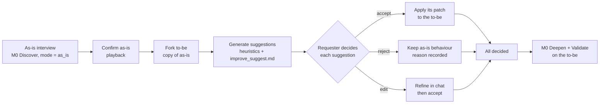

# M11 — As-Is Analysis & AI Improvement

## Purpose
When a process exists today, capture it as it really works (**as-is**), then **suggest where AI agents can help**.
Each suggestion explains what changes, why, what it saves and which human control stays. The requester **accepts or
rejects each one**. Accepted suggestions build the **to-be** process, which the stories and the to-be flow are written for.

## When it runs
- On a new idea, M0 asks **"Is there a process today?"** Yes → `mode = as_is`. The interview captures today's
  process (same coverage checklist, phrased "today…", plus slot **C17 effort & pain points**). No → `mode = idea`.
  The interview captures the desired process directly as the to-be, and M11 is skipped.
- A document-led process (M1/M2) is an as-is by nature (`variant = as_is`). M11 is offered once its coverage is complete.
- The requester can re-run suggestions at any time later ("Suggest more improvements"). New suggestions are added,
  and decisions already made are kept.

## As-is → to-be fork
1. The requester confirms the as-is playback. All as-is elements become `confirmed`.
2. The as-is is frozen (read-only, kept for comparison and the as-is flow).
3. The to-be is created as a deep copy with `process.variant = "to_be"`, `id = <as-is id>_to_be` (by convention)
   and `derived_from = {process_id, version}`. Recorded as a `fork` entry in the session timeline.
4. Every later change to the design is a patch on the to-be. The as-is never changes after the fork, except through an
   explicit "Correct the as-is" action, which re-opens it, re-forks and replays accepted suggestions.

## Generating suggestions

### Candidates (deterministic, `packages/improve/heuristics.py`)
| Heuristic | Triggers when | Suggestion kind | Default control proposed |
|---|---|---|---|
| Manual hand-off by email/phone | a `human_task` uses an email-like system, or pain point mentions email/chasing | `add_integration` / `automate_step` | none, or keep existing exception |
| Repetitive chasing | a task reached by an SLA breach route, done by a person | `automate_step` | keep the escalation exception |
| Manual check against a system that has an API | `human_task` with a `system_ids` actor whose description or SME answer mentions an API | `automate_step` | **human queue** for failures |
| Search/screening per item | pain point mentions "each", "separately", "one at a time" | `automate_with_review` | **human review** on exceptions/possible matches |
| Rule applied by hand | a `human_task` whose node has a `table`/`expression` rule | `deterministic_rule` | keep downstream approvals |
| Rekeying into a system of record | pain point mentions typing/rekeying, or the task writes to a CRM/ERP | `add_integration` | none (logged writes) |
| Approval with narrow criteria | an `approval` task where a rule branch is narrow (e.g. a single condition) | `automate_step` + sample review | **sample review** (low confidence) |

### Wording, ranking and evidence (LLM, `prompts/improve_suggest.md`)
Input: the as-is IR (or a subgraph per candidate), the candidates, pain points, effort, SME answers and scope. The LLM
writes the title (≤ 90 chars), the `change_summary` and `rationale`, picks **verbatim evidence** quotes, proposes the
patch `ops` against the to-be, and may add candidates the heuristics missed (flagged `source: llm`). It cannot remove
candidates.

### Guardrails (deterministic, applied after the LLM; violating suggestions are dropped and listed as "Not suggested")
1. **Never suggest removing or automating** an approval whose actor is named in `scope.out` or marked regulatory
   (e.g. "The final decision on high-risk clients stays with the MLRO"). These are listed under *Not suggested*.
2. **Every automation states a human control** (`controls`), even if "None needed: …". An `automated` step that can fail
   must route failures to a person (an exception with `manual_review` or `escalate`), or the suggestion is downgraded to
   `automate_with_review`.
3. **Evidence must be verbatim** (from intake answers, SME answers or source excerpts). Unverifiable claims are removed.
   If nothing remains, the suggestion is dropped.
4. **Benefit is computed, not guessed:** `hours_saved_per_month = minutes_saved_per_case × cases_per_month / 60`, with
   minutes from `as_is_effort.minutes_per_case` and volume from the `volume` NFR. If either is missing, benefit is qualitative only.
5. The `ops` must validate (dry-run through M3) and only touch the target node(s), exceptions/SLAs they create, and
   system/actor descriptions.

Schema: `schemas/suggestion.schema.json`. Sample: `samples/client_kyc/suggestions_client_kyc.json`.

## Deciding
- **Suggestion card:** title · what changes · why (with quoted evidence) · saves N min per client / H hours per month ·
  human control · risk · confidence. Buttons: **Accept**, **Reject** (reason required, one line), **Edit** (opens a
  chat scoped to the suggestion, e.g. "do it, but have an analyst review every rejection", which produces revised ops,
  then accept).
- Accepting applies the suggestion's ops to the to-be as one patch (author = requester, provenance
  `src_improve_<session>` with locator `{kind: "suggestion", value: "S04"}` and excerpt = the suggestion title).
  Touched nodes get `change = {kind, suggestion_id, was}`. Elements it creates are `confirmed` (accepting is confirming).
- Rejecting records the reason. The to-be keeps today's behaviour for that step.
- Phase exits when every suggestion is decided. The requester can also "Accept all remaining" (each is still recorded individually).

## Outputs
- **To-be flow** (M10) with `Changed by Sxx: was manual` on changed steps, and the **as-is flow** with minutes and pain points.
- **Improvements report** (`exports/improvements.md`): accepted/rejected, minutes and hours saved, human control, reasons.
- **"What changes from today"** table at the top of the stories file, and a *Change from today* line on each story (M7).
- Idea stats: suggestions accepted/rejected and hours saved per month (shown on the Ideas list).

## API
`POST /ideas/{id}/suggestions:generate` · `GET /ideas/{id}/suggestions` · `POST /suggestions/{sid}/accept` ·
`POST /suggestions/{sid}/reject {reason}` · `POST /suggestions/{sid}/edit {instruction}` → revised suggestion.

## Acceptance tests (fixture: `samples/client_kyc/`)
- **AC-M11-1** After the as-is is confirmed (T17), a `fork` creates `proc_client_kyc_to_be` with `derived_from` set to the as-is id and version.
- **AC-M11-2** The heuristics produce candidates for S01–S06 (and S07 at low confidence) from the as-is IR, effort and pain points.
  No suggestion touches `node_mlro_approval` (guardrail 1), and it appears under *Not suggested*.
- **AC-M11-3** Every suggestion's evidence is verbatim and its hours equal minutes × 150 / 60 (validator check).
- **AC-M11-4** Accepting S01–S06 and rejecting S07 yields `ir_client_kyc_to_be.json` before Deepen. Each accepted suggestion's `ops`
  equal the patch recorded in the timeline, and S07's reason is stored.
- **AC-M11-5** Changed nodes in the to-be carry `change.suggestion_id` exactly for the accepted set. The to-be flow labels them, and
  `improvements.md` totals ~275 analyst hours a month.
