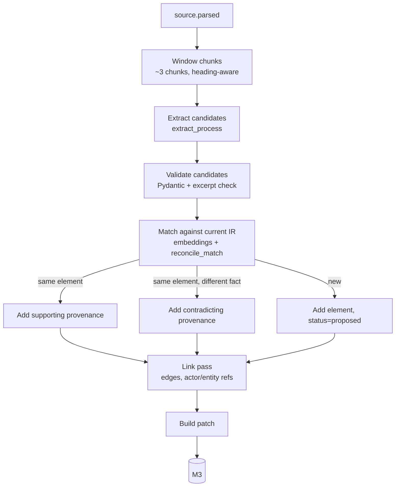

# M2 — Extraction & Reconciliation

## Purpose
Produce IR elements from parsed sources, merge them across sources, and surface contradictions — as patches.

## Pipeline

## Stage 1 — Candidate extraction
- Prompt `prompts/extract_process.md`. Input: process context (name, existing actor and
  entity names for consistency), chunk window text with block ids. Output: `ExtractionResult` JSON:
  candidates for actors, entities, steps (with type), decisions (with outcomes), rules, exceptions, SLAs, terms.
- Every candidate must cite `block_ids` and an `excerpt`. **Excerpt verification:** the excerpt must be a
  substring (after whitespace normalisation) of the cited blocks' raw text; otherwise drop the citation and set
  `extraction_certainty ≤ 0.3`. This blocks hallucinated evidence.
- Candidates include `extraction_certainty` (model self-report, capped at 0.9 by the confidence model).

## Stage 2 — Reconciliation
For each candidate, find match candidates in the current IR of the same element type:
1. Lexical/embedding similarity on `name + description` (top 5, cosine ≥ 0.75).
2. For ambiguous matches (0.75–0.9) or attribute differences, call `prompts/reconcile_match.md` → `{decision:
   same|different|same_but_conflicts, conflicting_fields[]}`.

Outcomes:
- `same` → add `supports` provenance to existing element. Never overwrite confirmed fields.
- `same_but_conflicts` → add `contradicts` provenance on the existing element with the conflicting field noted in
  `meta.notes`; M5 will raise `conflicting_sources`. Do **not** change the field value.
- `different` → new element with `status=proposed`.

Confirmed elements (`meta.status=confirmed`) are never modified by extraction; only provenance may be appended.

## Stage 3 — Linking
- Order steps using source order, explicit sequence words ("then", "once", "after") and heading structure; build
  edges. Decisions get one edge per outcome.
- Map step performers to actors (create actor if needed). Map mentioned data to entities.
- Infer missing `start`/`end` nodes with `src_inferred` provenance.
- Assign `automation_hint` heuristically: integration if an external system is named; deterministic_code if
  the step contains calculation/threshold language; human if approval/sign-off; ai_candidate for reading,
  classifying, summarising, drafting; else unknown.

## Output
One patch per extraction run (`author: agent:extractor`). First run on an empty IR → `auto_apply=true`. Later
runs → `proposed`, shown in the BA's review queue grouped by source.

## Idempotency
`extraction_runs` keyed by `(source_id, source_sha, prompt_file, prompt_sha256, model)`. Re-running with
the same key is a no-op.

## Acceptance tests
- **AC-M2-1** Given the three sample sources on an empty IR, when extraction completes, then the IR contains nodes
  equivalent to `samples/ir_client_onboarding.json` for: request docs, wait for docs, ID verification, screening,
  risk rating, risk decision, high-risk approval, conflict check, accept decision, engagement letter (name match
  via embedding ≥ 0.8 is acceptable).
- **AC-M2-2** Given SOP says "Engagement Partner approves high-risk" and the transcript says the MLRO does, then
  `node_high_risk_approval.meta.provenance` contains one `supports` and one `contradicts` ref.
- **AC-M2-3** Given a candidate whose excerpt is not in the cited block, then its citation is dropped and
  certainty ≤ 0.3.
- **AC-M2-4** Given an element with `status=confirmed`, when a new source disagrees, then the field value is
  unchanged and a `contradicts` ref is appended.
